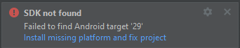
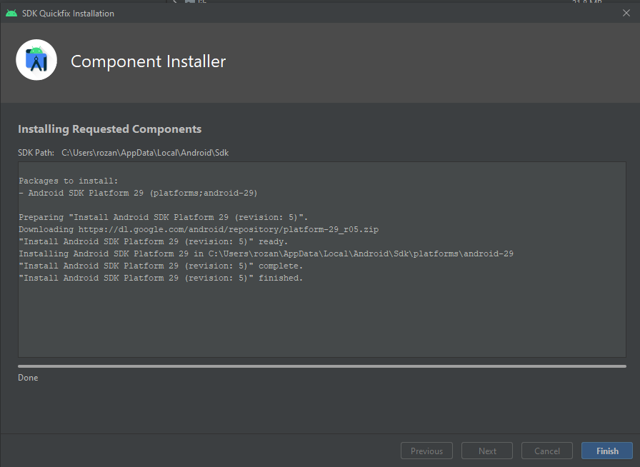
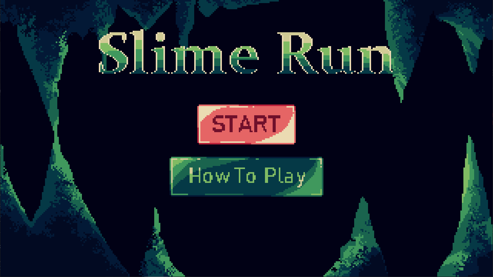
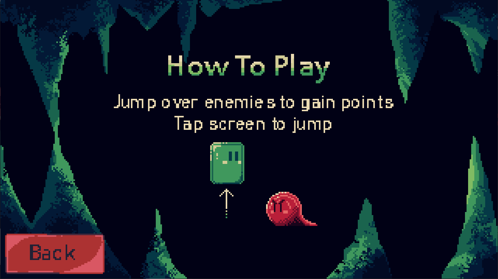
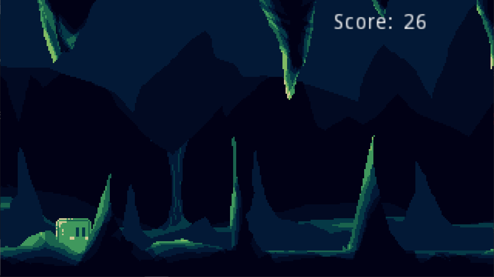
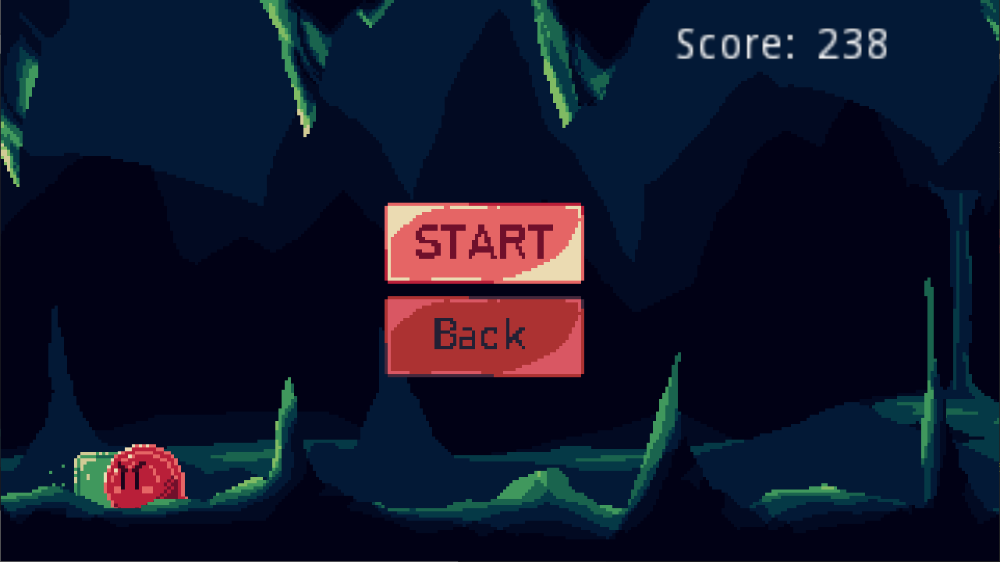

# Slime Run

By Rozanna Abramtsis, Rajan Perry, and Brianna Rentfrow
Android Mobile Development Term Project

[Link to Backlog](Team-6-Endless-Runner-App-backlog.xlsx)

## Navigation
 - [Android Studio Setup](##android-studio-setup)
 - [Game Setup](##game-setup)
 - [Game Play](##game-play)
 <!-- - [x] test        - THIS ADDS A CHECK-MARKED CHECK BOX -->
 - *No fixed header-linking in README file, please use `Ctrl + F` to search.*

## Android Studio Setup

1. Install Android Studio by following [these instructions](https://developer.android.com/studio/install).

2. Open the AVD Manager, and click on the `Create Virtual Device` button. Select a device that has `Play Store` capability, click `Next`, and download and select API level `29`. Then click `Finish`.

## Game Setup

1. Download the APK file from [this link](https://third-from-the-left.itch.io/slime-runner), or download the APK file from this repo.

2. Open Android Studio. Go to `File` > `Profile or Debug APK`, and navigate to the location of the APK. Click on the `OK` button, and open the project in a new window.

NOTE: If an SDK error occurs, click on the error to see more information.

3. Go to `Run`, `Run 'app'`, and the emulator with the game application will appear.

## Game Play

[Demo Video file](demo-video.mp4) (download the file to watch it)

1. The game starts at the main menu screen.

2. Tapping the `How to Play` button sends users to the instructions screen to see how to play the game.

3. Tapping the `Back` button sends users back to the main menu.

4. Tapping the `Start` button switches to the game screen, where users can play the game.

Users can tap the screen to have the green Slime jump and avoid red Slimes.

5. Losing the game displays buttons to start playing again or going back to the main menu.

